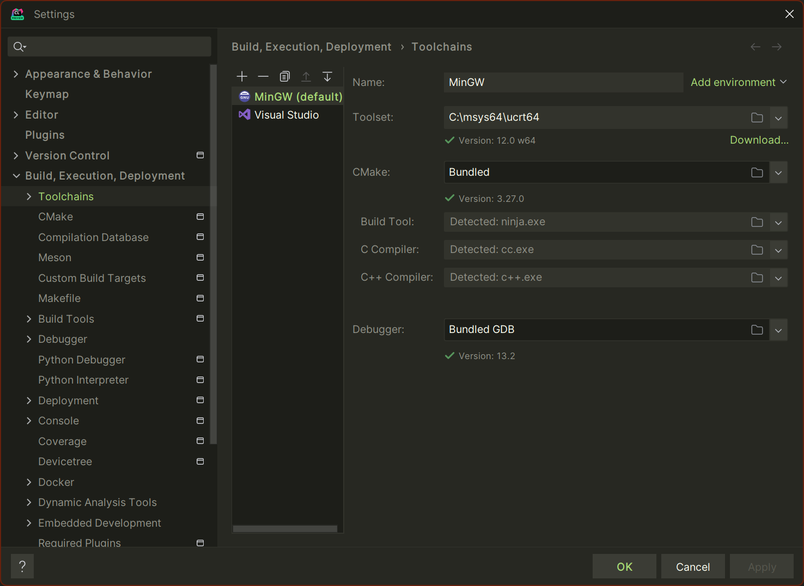
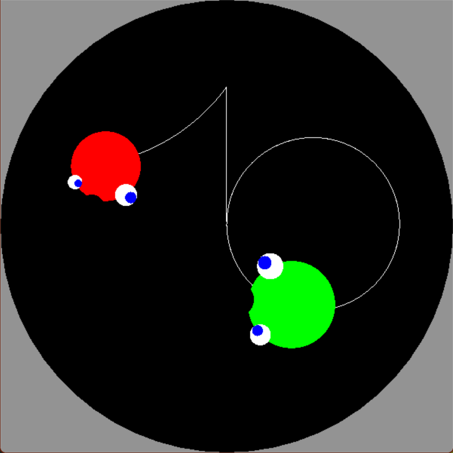
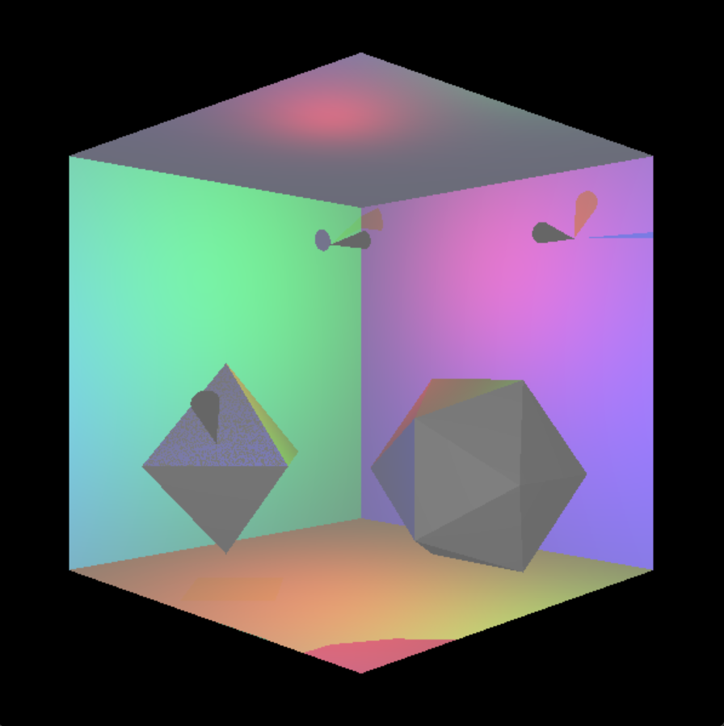

# Grafika HF 2022/23-2
## Bevezető
> Ezek a megoldások az én saját háziaim és nem vállalok felelősséget utána, hogy helyesek-e. Csupán segítség képpen vannak publikálva vagy ikhlet merítésnek

## Projek telepítési segédlet
### Windows
> Kell egy compiler először, hogy lehessen majd futtatni az alkalmazást illetve meg kell szerezni valahonnan a fejlesztési dependency-ket mint az OpenGL és a FreeGlut.
Legegyszerűbb ezt egyben megtenni a [MSYS2](https://www.msys2.org/) segíségével.
1. Nyisd meg az [**MSYS2**](https://www.msys2.org/) oldalát és kövesd a telepítési instrukciókat.
2. Ezután telepítjük a **freeglut**-ot és a **glew**-t a következő commanddal az **msys**-ben.

`pacman -S mingw-w64-ucrt-x86_64-freeglut &&  pacman -S mingw-w64-ucrt-x86_64-glew`
3. Ha sikeresen települt bezárhatjuk az MSYS-t.
### Clion
Ahoz hogy fejleszteni tudj először egy környezet kell és a legegyszerűbb a [CLion](https://www.jetbrains.com/clion/download/).
> Ez ingyenesen használható az egyetem álltal a bme-s email-el
1. Miután települt nyisd meg a projektet és fel fog dobni egy ablakot ahol ki lehet választani hogy milyen "**toolchain**"-t akarunk használni.
> Ha nem dobja fel akkor a file menüben a settings fül alatta a "Build, execution, deployment" menü alatt a toolchains-t kell válasznani amiben ha van MinGW akkor arra nyomj rá ha nincsen akkor a + ikonra és adj hozzá.
2. Itt állítsuk át a **bundled**-et a **Toolset**-nél `C:\msys64\ucrt64`-re.

3. Ezután már tudod is használni a projektet.

### MacOS

## HF1 - Hiperbolikus "UFO-hami"
[Project link](./HF1)

## HF2 - Lehallgatástervező
**!!Fontos!!: a megoldás buggos mert a cone nem árnyékolja a fényforrását.**

[Projekt link](./HF2)

